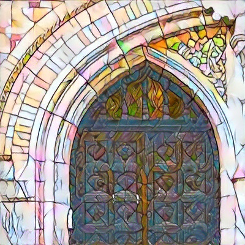
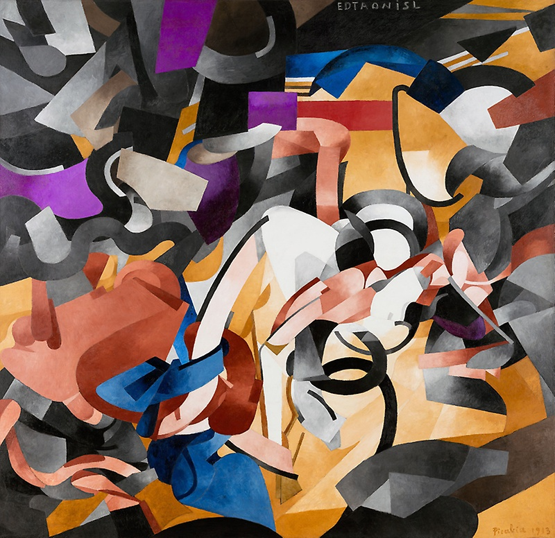

# Neural Style Transfer :rocket:
This repository contains a pytorch implementation of an algorithm for artistic style transfer. The algorithm can be used to mix the content of an image with the style of another image. For example, here is a photograph of a door arch rendered in the style of a stained glass painting.

<p align="center">
    
    
    
</p>

<p align="center">
    
    
    
</p>

<p align="center">
    
    
    
</p>

<p align="center">
    
    
    
</p>

<p align="center">
    
    
    
</p>

<p align="center">
    
    
    
</p>

## Requirements
The program is written in Python, and uses [pytorch](http://pytorch.org/), [scipy](https://www.scipy.org). A GPU is not necessary, but can provide a significant speed up especially for training a new model. Regular sized images can be styled on a laptop or desktop using saved models.

## Usage
Stylize image
```
python neural-style-transfer/train.py  --data_dir <path/to/directory> --content_image <content image name> --style_image <style image name> --output_image <output image name> 
```
* `--data_dir`: path to directory where your images are saved.
* `--content_image`: name content image you want to stylize.
* `--style_image`: name of style image from which you want to extract style
* `--output_image`: path for saving the output image.
